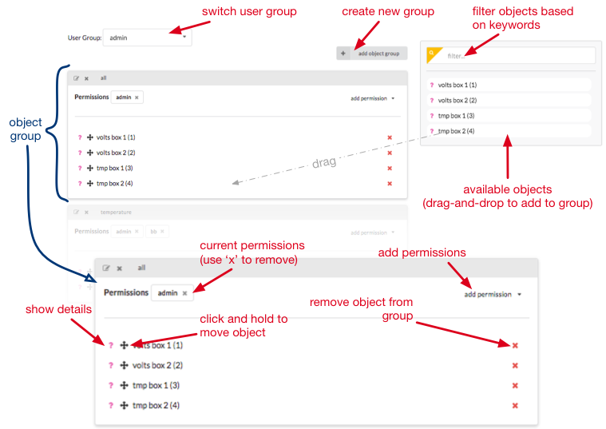

The <a href="https://bbdata-admin.daplab.ch" target="_blank">admin console</a> is used by user group administrators to manager objects, users and permissions.

## Overview

Past the login screen, the admin console is split into four tabs: _objects_, _object groups_, _users_ and _me_. Those tabs corresponds to the output api main entrypoints (see [the output api REST documentation](https://bbdata.daplab.ch/api)).

:::info
Resources you don't have access to are not visible on the interface. 
:::

## Objects tab

The objects tab lets you view, create, edit and delete virtual objects as well as the tokens associated to each of them. The image below shows you how to perform the main actions available on the objects tab:

## Objects Group tab

The object group tab let's you manage object groups. 

:::info
If you are administrator of multiple user groups, you can select a user group in the dropdown menu on the top left corner. 
:::

Object groups are on the left of the window, each one delimited by a grey border. Each object group has a name and a list of objects. The list of available objects is on the right. 

Once you created an object group, you can drag and drop objects into it. Objects are listed on the right box. Don't hesitate to filter the objects based on a keyword using the _filter box_. 

To remove an object from a group, use the <i class="fa fa-times"></i> icon on the right of the object name. You can also move objects between groups using the <i class="fa fa-arrows"></i> icon on the left. Finally, the <i class="fa fa-question"></i> icon displays more information about an object.

:::info
Changes are automatically saved. 
:::

## Users tab

The users tab let __administrators__ manage user groups. In case you are not administrator of any group, the tab will be empty.

__Creating a group__

You need to be administrator of at least one user group before being able to create objects. The button at the top of the interface let you create a new group. A user group should have a unique name. In case the name of the group is not unique, an error message appears on the lower right.

__Managing users__

To add existing users, click on the button "_add existing_". A dialog appears with a dropdown list. Select as many users as you want. By default, a new user has a _regular user_ role. To make them admin, click on the <i class="fa fa-user"></i> icon so it becomes a <i class="fa fa-shield"></i>. Once done, click on save.

In case you want to add a new user, click on the "_create user_" button on the lower left of the group and fill the form. 

To delete users from a group, use the <i class="fa fa-remove"></i> icon on the right of the username.

The interface does not let you modify a user role (admin <=> regular user). To change a user role, you need to remove the user, then add it again with the new role.

:::warning
Ensure that user groups always have _at least one_ administrator. A user group with no administrator makes the group and all its objects immutable ! 
:::

## Me tab

This tab lists your profile, the list of user groups you are part of (as an administrator or a reguar user). It is also the place to manage your apikeys.

As explained [here](conception.md), apikeys are used to access the _output api_. It is also used by the admin console. When creating an apikey, you can specify an expiration date as well as a description. Both are optional. An apikey without expiration date will be valid forever.

When creating a new apikey, the expiration date is expressed as a duration from now. The format is `[0-9]*d-[0-9]*h-[0-9]*m-[0-9]*s`. For example, `1d-4h` means _1 day and 4 hours_. 

An apikey can also be read-only or read-and-write. A read-only key is useful to let an application access the data, while a read-and-write key is useful for an application which automatise the resources creation.

