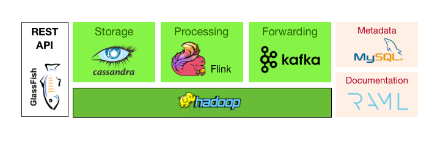

## The journey of a measure

To better understand how BBData works, we review the journey of a measure into the BBData pipeline. 

In __(1)__, different kind of sensors produce measures. Those sensors might come from different manufacturer and use various data encodings. To ensure the compatibility of the platform with any kind of equipment, BBData uses the concept of virtual objects. A _virtual object_ has metadata, such as name, unit and type and can be mapped to a real sensor through an ID. This mapping is handled by collectors __(2)__. A _collector_ creates a bbdata record for each measure and sends it to the input api in a structured JSON format. In case some sensors lack an internal clock, the collector can also produce a timestamp. The _input api_ __(3)__ is a JavaEE REST service running on [GlassFish](https://glassfish.java.net) whose role is to validate the incoming measure and ensure its authenticity using the object’s ID and a secure token. If the check succeeds, security informations are dropped and the resulting JSON is added to an [Apache Kafka](https://kafka.apache.org/) message queue __(4)__ for processing. The content of this queue is also dumped periodically to HDFS, so the raw inputs can be replayed anytime. Before processing, the measure is first ”augmented” with the virtual object’s metadata pulled from a [MySQL](https://www.mysql.com) database __(5)__. The result is stored in a second message queue using a compressed format __(6)__. 

BBData also provides a _MQTT Endpoint_ __(10)__ which allows IoT devices to use a lighter protocol if necessary. The endpoint uses the same data processing pipeline as the _input api_ __(3)__, meaning that you'll be able able to access your measures using the _output api_ __(8)__ as if you were using the _input api_ __(3)__. As of now, it is not possible to subscribe to a MQTT topic, only the publish functionnality (with the three level of QoS) is supported. The format of the measure is expected to be a JSON similar to the format used by the _input api_ __(3)__ and is sent in the publish packet payload. The _MQTT Endpoint_ __(10)__ will then rapidly forward the measure to kafka __(11)__, so that it is replicated and saved on disk as quickly as possible. It is then validated __(12)__ using the same validation process as the _input api_ __(3)__; authenticity of the object's ID and token are verified as well as the provided data type for the required fields. In cases where the measure is valid, it is sent into the standard processing queue __(4)__, otherwise it is sent into an error queue __(13)__. Users will be alerted by email __(14)__ every 15mins in case one of their measure falls into the error queue.

In BBData, _processing_ covers a wide area of tasks. It goes from the saving of raw values into a persistent store to the detection of anomalies or the computation of time aggregations. Each of these tasks is handled by a specific processor. Processors are independent streaming applications running in a hadoop cluster. They subscribe to the augmented Kafka topic, carry their task and save their output, if any, in a Cassandra database. This design makes it possible to add or remove processors without any impact on the system. We have currently two kind of processors, both implemented with Apache Flink4: the first saves the raw records to Cassandra, the second one computes live time aggregates (mean, max, last measure, standard deviation) with a granularity of fifteen minutes, one hour and one day.

Users and building automation applications can access the data and manage virtual objects through a standard REST interface called the _output api_ (7) or via _HTML5 web applications_.

## The journey of a BBData user 

Here is an overview of what a user has to do to make use of BBData.

Say Foo just decided to use BBData. Foo has one sensor connected to a raspberry pi which measures both the temperature and the humidity of the room every minute.

The first thing Foo needs to do is to create two _virtual objects_ using the [BBData admin interface](https://admin.bbdata.ch) __(1)__. Among the informations, Foo gives the type (float for both) and unit (degrees and percentage) of the objects. The system will then give Foo a unique ID for each sensor, which foo can use to send new measures. 

To ensure only Foo can post data linked to his virtual objects, BBData uses _token_. A token is a string of 32 characters that has to be present for any new measure to be accepted by the system. Using the interface, Foo thus creates a token for each of his virtual objects. The configuration phase is done.

Foo will then write a little program on the raspberry pi which sends an HTTP POST to the _Input API_ every time a new measure is available. Depending on the measure type (temperature or humidity), Foo's program will specify a different _object id_ and _token_ in the request body. 

That's it ! All his data are now safe and stored on the DAPLAB. Foo can use the _visualisation webapp_ __(2)__ to visualise his data as graphs or use the _output API_ directly to get raw values or aggregations during a period of time __(3)__. 

Now, let's say Foo's coworkers are also interested in the temperature and humidity of Foo's room. Foo could create a group on the BBData admin interface __(1)__, add his collegues to it and then give them read-only access to his sensor's data. If he changes his mind afterwards, a simple clic on the admin interface will revoke the permissions.

## BBData Main Advantages

Here are some of the major advantages of BBData:

1. _Uniformed and Standardised Storage_: with BBData, all measures are stored using the same abstraction, allowing users to interact with data from any source in the same way;
2. _Horizontal Scalability_: the BBData pipeline is built on top of Hadoop technologies and configured to be able to process terabytes of data if needed without loosing performances;
3. _User Management and Permissions_: every datasource in BBData belongs to a user, and the user can control who has access to its data in a fine-grained manner. This makes data both protected and easily shared among group of users;
4. _Stream Processing_: in many systems, users have the possibility to get statistics and derived informations about their data such as mean, max, aggregations, etc. But most of the time, those statistics are computed on-the-fly and on-demand. In BBData, _processors_ run as soon as the data are available and already compute all the statistics a user could need, so queries are very fast. 

## Technologies

The BBData ecosystem runs on Hadoop and uses free, open-source technologies. 

## Software versions

 

|                  | Version        | 
|-----------------:|:---------------| 
| YARN             | 2.7.3          | 
| HDFS             | 2.7.3          | 
| Apache Flink     | 1.2.0          | 
| Apache Kafka     | 0.10.0         | 
| Apache Cassandra | 3.0.7          | 
| GlassFish        | 4.1 (patched)  |
| MySQL            | 5.7.14         |  
| RAML             | 1.0            | 

## Source code 

The sources for the different components of BBData are separate git projects stored on the [GitLab of the HEIA-Fr](https://gitlab.forge.hefr.ch/users/sign_in) under the group [BBData](https://gitlab.forge.hefr.ch/bbdata). Here is a small overview of the different projects:

__APIs__: 

The API is split between the [input API](https://gitlab.forge.hefr.ch/bbdata/input-api), used to post new measures, and the [output API](https://gitlab.forge.hefr.ch/bbdata/output-api), which takes care of permissions, object and user management and querying. Both are Java EE applications running on GlassFish.

Soon, BBData will offer an MQTT endpoint for submitting new values. This is developed in the [input-mqtt-gateway](https://gitlab.forge.hefr.ch/bbdata/input-mqtt-gateway) project. 

__Processing__:

We have currently 3 processors, each of them written as Flink applications. The project [flink-basic-processing](https://gitlab.forge.hefr.ch/bbdata/flink-basic-processing) contains the code for the two most important processors: (a) augmentation, (b) saving of raw values.

The project [flink-aggregations](https://gitlab.forge.hefr.ch/bbdata/flink-aggregations) contains the code for doing aggregations on float data.

__Web Interface__: 

The code for the admin interface is available in the [webapp](https://gitlab.forge.hefr.ch/bbdata/webapp) project. It is a simple NodeJS application using AngularJS and Bootstrap4.

__Development__:

The [docker-infrastructure](https://gitlab.forge.hefr.ch/bbdata/docker-infrastructure) project contains docker image definitions and docker-compose files to run parts or all of the BBData pipeline on a local computer. This is for development only, as the pipeline has many components that are resource consuming.

[data-faker](https://gitlab.forge.hefr.ch/bbdata/data-faker) is a little commandline tool written in Go to generate and submit fake measures to the input API.

[bbcheck-pytg](https://gitlab.forge.hefr.ch/bbdata/bbcheck-pytg) is a little python program that monitors the different parts of the pipeline and sends a message using Telegram in case of failure.

__Other__:

[dbs](https://gitlab.forge.hefr.ch/bbdata/dbs) contains the scripts to setup the mysql database and the cassandra keyspace.

(_deprecated_) [bbdata-commons](https://gitlab.forge.hefr.ch/bbdata/bbdata-commons) is a Java project (maven) defining common utility classes for dealing with measures and UTC dates. It has since been replaced by [jodatime-utils](https://gitlab.com/LucyLinder/jodatime-utils) hosted on gitlab and available in [bintray](https://bintray.com/derlin/maven/jodatime-utils).

(_deprecated_) [wiki](https://gitlab.forge.hefr.ch/bbdata/wiki/wikis/home) doesn't contains any source, but was used to centralized information on its wiki (gitlab feature). It is replaced by the current website.

(_deprecated_) [raml-and-tests](https://gitlab.forge.hefr.ch/bbdata/raml-and-tests) contained the RAML definition of the output API which has been migrated to the output API project itself and a test suite using rest-assured. Testing is now mostrly done using Postman.

