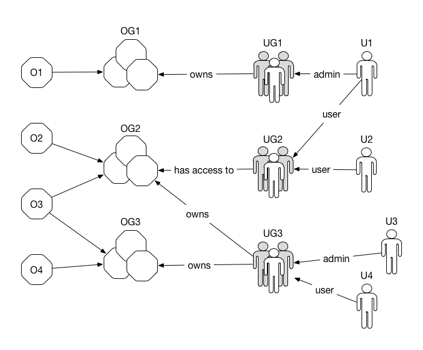

In BBData, datasources are represented by _virtual objects_ which belong to zero or more _object groups_. Users belong to one or more _user groups_. User groups have access to zero or more object groups. 

## Virtual objects

Virtual objects are the most important abstraction in BBData. A virtual object represents a datasource; it is a container that holds measures of the same type. 

### Mapping 

Real word sensors can be mapped to one or many virtual objects. To better understand the concept, let's see some examples of virtual objects.

* _one-to-one mapping_: A basic sensor measuring the temperature of the room is mapped to one virtual object. 
* _one-to-many mapping_: A more complex sensor able to measure the temperature as well as the humidity and the number of times the door opens needs three virtual objects. This way, temperature measures won't be mixed with humidity and aggregations will be performed separately for each type of measurements.
* _many-to-one mapping_: say we have a building with temperature sensors on each room, but we are only interested in the global temperature. As long as the different sensors don't emit measures at exactly the same time, we could use only one virtual object in BBData. This way, aggregations will be automatically performed to reflect the whole temperature in the building.

### Metadata

Metadata are associated to each virtual objects:

* _id_: a unique identified, generated automatically be the system upon creation.
* _creation date_: when the object has been created.
* _name_: an arbitrary name, maximum 45 characters long.
* _description_: an optional description, such as the localisation of the datasource.
* _unit_: the measure unit, such as `vol`, `degrees` or `on/off`. The object's unit determines the measure type (_string_, _boolean_, _float_ or _integer_).
* _tags_: a list of user-defined tags. Tagging objects makes tag-based search and lookups possible.
* _state_: an object can be _enabled_ or _disabled_. Disabled objects cannot receive new measures.
* _owner_: as explained below, an object belongs to a usergroup. Only administrators of the owning group can make modification to the object.

:::info
Currently, aggregations are performed only on objects with unit _lx, m/s, %, A, ppm, V, W_ or _°C_.
:::

## Object groups

Object groups let user group similar objects together. 

An object group has zero or more objects, while objects can be part of zero or more object groups. Furthermore, an object group belongs to a user group and all its objects must have the same owner.

How to group objects is left to the user. Common grouping schemes are location (site 1/level 1, site 1/level 2, etc.) and function (thermostats, electricity, etc.). 

Object groups can also be used to share some objects with another user group, either temporarily or permanantly. Indeed, creating or deleting a group won't alter the objects, making them highly flexible. 

## Users and usergroups

A BBData user can belong to one or more user groups. Users in user groups can be one of two kinds:

1. __regular user__: a regular user has _read-only_ access to objects in object groups that the user group has access to;
2. __administrator__: an administrator can create, edit and modify objects, manage object groups and grant/revoke permissions on behalf of the user group.

## User rights and sharing

The notion of _ownership_ is used to determine who can modify or delete a resource (objects, object groups, etc).  Only user group administrators are allowed to create, edit or delete resources. A resource belongs to the user group that created it. 

Using user groups and administrators instead of user-based ownership avoids troubles when someone quits the system. Indeed, as long as groups have administrators, resources are always editable.

The notion of _sharing_ determines who can access resources in read mode (get metadata, query values, etc). By default, all regular users of the user group owning a resource can access it in read-only mode. Furthermore, an administrator can decide to share an object group with other user groups. The right is transitive: if a user group UG can access the object group OG, any user U in UG can access all the objects in OG.

In the image above, 

* U1 can edit O1 and access data (read-only) associated to objects O2 and O3;
* U2 can access data (read-only) associated to objects O2 and O3;
* U3 can edit O2, O3 and O4;
* U4 can access data (read-only) associated to objects O2, O3 and O4;

Given the permission graph, we can also guess that O1 has been created by UG1, and O2-4 by UG3.

##  Security

REST endpoints need to be secured by an authentication mecanism. To achieve that, we use _tokens_ and _apikeys_. Both tokens and apikeys are cryptographically secured, randomly generated strings of 32 characters.

:::tip
Tokens and apikeys can be managed through the admin webapp.
:::

### Tokens 

Tokens are associated with objects and are used to submit new measures (_input api_). Most of the time, tokens are used by applications or middleware, not by humans. For each new measure, the input api checks that the pair `<token, objectID>` in the body is valid. If not, the measure is simply discarded.

Objects can have multiple tokens. It is the charge of the administrators to ensure they stay secret. In term of rights, only administrators of the usergroups who created an object can view, create and delete its tokens.

### Apikeys

Apikeys are associated with users and are used to access the output api. 

Apikeys have two extra properties:

* _expire_: apikeys may have an expiration date;
* _read-only_: apikeys can be read-only or read-and-write.

To get an apikey, users login to the output api using the `/login` endpoint. They provide their username and password and the api returns a read-and-write token _valid for two hours_. To revoke the apikey before its expiration, a `/logout` endpoint is also available. 

If users want to grant access on their behalf to an application, for example to automatise object creation or data retrieval, they can also create apikeys explicitly with the settings they see fit (see the `/me/apikeys` endpoint).

It is important to stress that an apikey gives access to the api _on behalf_ of the user: it is his responsibility to manage them properly.
